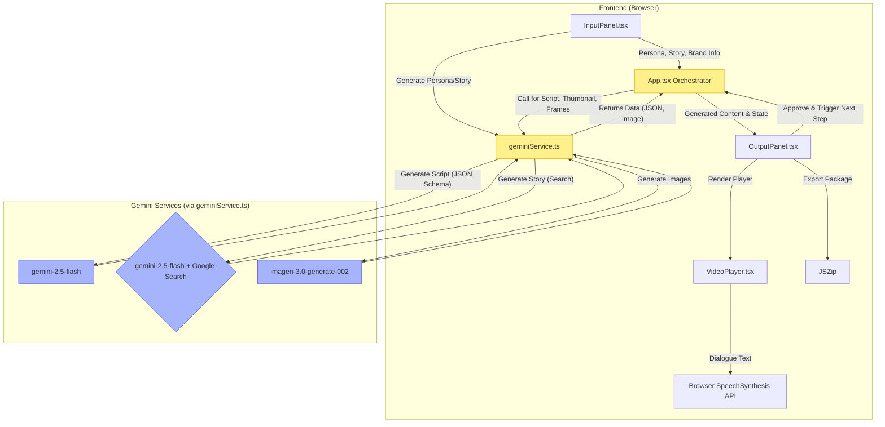

# The Green Lens - Climate Content Creator

A generative AI application that creates a complete short-form video content package—including a title, script, thumbnail, and animated video frames with a voiceover—from a user-defined audience persona and a climate-focused storyboard.

## Features
*   **AI-Powered Scripting**: Generates a title, detailed thumbnail prompt, and scene-by-scene script (visuals + dialogue) based on an audience persona and a story concept.
*   **Persona Generation**: Create detailed audience personas from scratch using a form, or generate one randomly for inspiration.
*   **Topical Story Generation**: Generate story ideas based on specific topics or leverage Google Search to get ideas from the latest climate news.
*   **AI Image Generation**: Creates a stunning, high-quality thumbnail and all video frames (9:16 aspect ratio) using text-to-image models.
*   **Automated Video Preview**: Plays the generated content as an animated video with Ken Burns effects and a voiceover using the browser's Speech Synthesis API.
*   **Brand Integration**: Seamlessly integrate promotional content for a brand or product, including using a reference image for the AI.
*   **Full Package Export**: Download all generated assets (script `JSON`, thumbnail `JPEG`, frame images) in a single `.zip` file.

## Architecture
The application is a client-side single-page application (SPA) built with React. It orchestrates multiple calls to the Google Gemini API to generate a full creative package. There is no traditional backend server; all logic is handled in the browser.

The high-level flow is as follows:
1.  **Input**: The user provides (or generates) a persona and story.
2.  **Script Generation**: The inputs are sent to `gemini-2.5-flash` to create a structured `CreativePackage` (title, thumbnail prompt, scenes).
3.  **Asset Generation**: After user approval, the app calls `imagen-3.0-generate-002` to create the thumbnail and then all individual video frames.
4.  **Playback & Export**: The final assets are presented in an animated video player and can be exported as a `.zip` file.

## Technology Stack
*   **Framework**: [React](https://reactjs.org/)
*   **Language**: TypeScript
*   **AI Models**:
    *   Google Gemini (`gemini-2.5-flash`) for text generation, JSON output, and search-grounded content.
    *   Google Imagen (`imagen-3.0-generate-002`) for image generation.
*   **API Client**: [`@google/genai`](https://www.npmjs.com/package/@google/genai)
*   **Styling**: [Tailwind CSS](https://tailwindcss.com/)
*   **Utilities**: [JSZip](https://stuk.github.io/jszip/) for exporting assets.

## Getting Started
To run this application, an API key for the Google Gemini API is required.

### Prerequisites
*   A modern web browser.
*   A valid Google Gemini API key.

### Configuration
The application is configured to read the API key from the `process.env.API_KEY` environment variable. Ensure this variable is set in the execution environment where the application is hosted.

**Note**: The application **does not** provide a user interface for entering the API key. It must be configured in the environment beforehand.

# Run and deploy your AI Studio app

This contains everything you need to run your app locally.

## Run Locally

**Prerequisites:**  Node.js

1. Install dependencies:
   `npm install`
2. Set the `GEMINI_API_KEY` in [.env.local](.env.local) to your Gemini API key
3. Run the app:
   `npm run dev`
